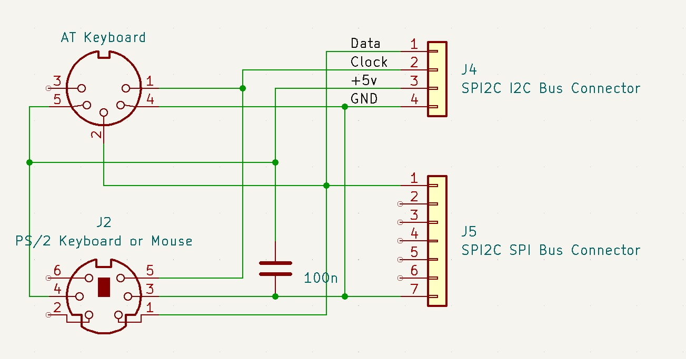

This is a practical example of putting the SPI2C board to good use. It allows the conection of an AT or PS/2 keyoard, or a PS/2 mouse.

Sample code is provided to read in keystrokes or mouse data, and putputs it to the serial terminal.

